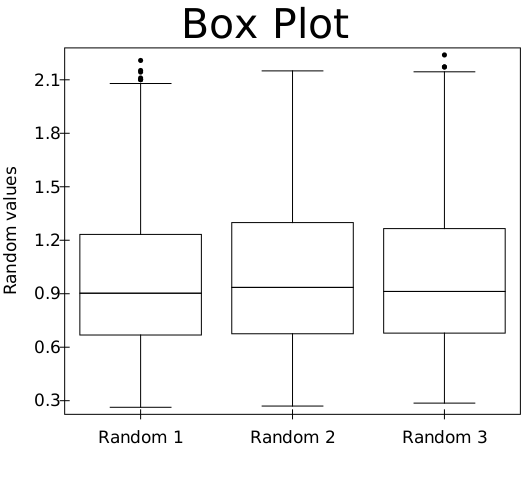

# SwiftVis 2 Examples

This is where you can find various examples of SwiftVis2 usage. Until this is finished, you'll find code to produce the testings plots
in [playground.PlotTesting](https://github.com/MarkCLewis/SwiftVis2/blob/master/src/main/scala/playground/PlotTesting.scala).

## Programmatic Usage

I'm working first to develop the ability to do programmatic plotting. A big part of the goal here is to make something that people can use to quickly
and easily plot data with Spark when using Scala. For that reason, I have defined a number of facade methods in the `Plot` object that provide a
simple interface for producing plots.

### Scatter Plots

This is almost certainly the most common plot style in scientific plotting. As such, it is well developed in SwiftVis2. In addition to the standard
abilities to provide x and y values for points, the SwiftVis2 scatter plot allows you to provide per point colors, point sizes, and error bars.
The points can also be connected with lines using a mechanism that allows you to make multiple line plots from a single set of data.

Here is a simple example of two data sets plotted in different colors that share the same axes.

### Scatter Plot Grid

SwiftVis2 plots are really just combinations of a few basic elements including text and plot grids. Most of the time people use 1x1 grids to have all
plots in a single area as the example above demonstrates. There is a simple facade method that makes regular grids of scatter plots like the example
below. 

### Histogram

The histogram style can be drawn with values stacked or not. It can also draw the bins either centered on the bin value or spanning the bin values.
Note that the histogram method in Spark produces the latter option. This is significant as when you don't center, the bin data needs to have one more
element than the counts.

### Bar Charts

The bar chart utilizes a categorical axis. The bars can be drawn side-by-side or stacked.

### Box Plots

The box plot has a categorical X-axis and a numeric Y-axis. The user can provide whatever values desired for the data on the boxes, but a convenience
method in the companion object calculates the quartiles and puts the min and max values no more than 1.5 IRQs above or below the quartiles, then draws
outliers beyond those values. 

### Violin Plots

The violin plot has a categorical X-axis and a numeric Y-axis. The user provides the data and an option bandwith. The density function is approximated
using normal kernels and lines are drawn for the quartiles.

### Full Plotting Capabilities

All the plots above were made using facade methods that provide a shortcut syntax. However, you can also construct your own plot grids with whatever
plot styles and axes you want, with variable width rows and columns. An example of this, which also shows many of the different capabilities of SwiftVis2
is shown here.

## Graphical Interface Usage

The graphical interface isn't currently implemented.